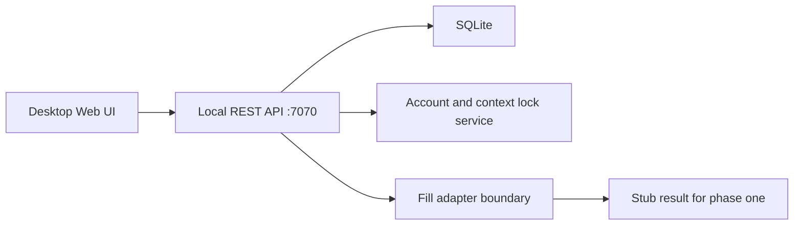

# TLM Initial Architecture

## Goals

TLM starts as a local-first Web application that solves daily test login preparation. It should be easy to run on a tester's machine, keep account/session state visible, and preserve clean boundaries for a future automation platform.

## Runtime Shape



The backend uses Python standard library HTTP serving for this first pass so the project can run without package installation. The module boundaries are intentionally compatible with a later FastAPI migration:

- `main.py`: route parsing, static serving, JSON responses.
- `services.py`: business rules, validation, and state transitions.
- `repositories.py`: database reads and writes.
- `playwright_adapter.py`: future integration boundary. This file intentionally contains no Playwright script.

## Data Model

`systems`

- `id`: UUID primary key.
- `name`: business system name.
- `login_url`: HTTP or HTTPS login page.
- `env_tag`: `TEST`, `UAT`, or `PRE`.
- `note`: optional description.
- `sort_order`: sidebar ordering.

`accounts`

- `id`: UUID primary key.
- `system_id`: parent system.
- `role_label`: role name, for example "管理员".
- `display_name`: UI label.
- `username`: visible username.
- `password_enc`: encrypted or development-encoded password.
- `status`: `idle`, `active`, or `locked`.
- `session_id`: current holder when active.
- `extra_fields`: JSON extension point.

`browser_sessions`

- Tracks active fill sessions by account, system, browser mode, and context key.
- Used to enforce "same system, same browser context" blocking rules.

`operation_logs`

- Records account management and fill attempts.
- Passwords are never logged.

## API Contract

```text
GET    /api/health
GET    /api/systems
POST   /api/systems
PUT    /api/systems/{id}
DELETE /api/systems/{id}
GET    /api/systems/{id}/accounts
POST   /api/systems/{id}/accounts
POST   /api/fill
GET    /api/accounts/{id}/status
POST   /api/accounts/{id}/release
POST   /api/accounts/{id}/lock
GET    /api/browser/guest-sessions
GET    /api/logs
```

## Fill Flow

1. The user selects a system, account, and browser mode.
2. The UI calls `POST /api/fill` with `system_id`, `account_id`, `browser_mode`, and `context_key`.
3. The service rejects locked or active accounts.
4. For normal browser mode, the service blocks a second active session for the same system in the same context.
5. The account becomes `active`, a browser session row is created, and the adapter returns a phase-one stub result.
6. The UI refreshes account cards and shows a toast. Releasing the session returns the account to `idle`.

## Deferred Work

- Real Playwright browser launch, DOM locator strategy, and CAPTCHA focus behavior.
- CDP-backed guest profile discovery.
- Keychain or AES-256 key management for production credentials.
- UI automation tests. This pass intentionally does not add Playwright test scripts.
